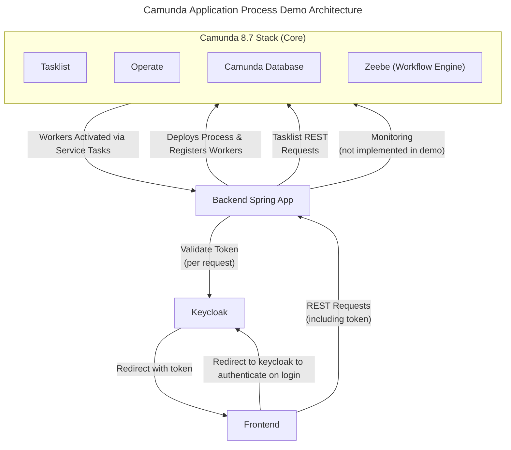
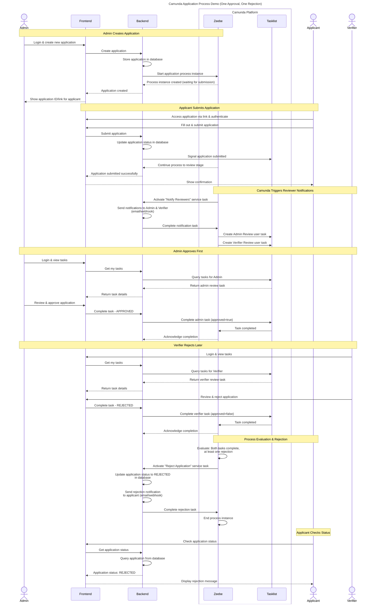

```mermaid
---
title: Camunda Application Process Demo Architecture
---
flowchart
    subgraph camunda["Camunda 8.7 Stack (Core)"]
        direction TB
        tasklist["Tasklist"]
        operate["Operate"]
        camunda_database["Camunda Database"]
        zeebe["Zeebe (Workflow Engine)"]
    end
    backend["Backend Spring App"]
    frontend["Frontend"]
    keycloak["Keycloak"]
    camunda--->|Workers Activated via Service Tasks|backend
    backend--->|Deploys Process & Registers Workers|camunda
    backend--->|Tasklist REST<br>Requests|camunda
    backend--->|"Monitoring<br>(not implemented in demo)"|camunda
    backend--->|"Validate Token<br>(per request)"|keycloak
    frontend-->|"Redirect to keycloak to authenticate on login"|keycloak
    keycloak--->|Redirect with token|frontend
    frontend-->|"REST Requests<br>(including token)"|backend
```

```mermaid
---
title: Camunda Application Process Demo (One Approval, One Rejection)
---
sequenceDiagram
    actor Admin
    participant Frontend
    participant Backend
    box Camunda Platform
    participant Zeebe
    participant Tasklist
    end
    actor Applicant
    actor Verifier

    Note over Admin,Zeebe: Admin Creates Application
    Admin->>Frontend: Login & create new application
    Frontend->>Backend: Create application
    Backend->>Backend: Store application in database
    Backend->>Zeebe: Start application process instance
    Zeebe-->>Backend: Process instance created (waiting for submission)
    Backend-->>Frontend: Application created
    Frontend-->>Admin: Show application ID/link for applicant

    Note over Applicant,Frontend: Applicant Submits Application
    Applicant->>Frontend: Access application via link & authenticate
    Applicant->>Frontend: Fill out & submit application
    Frontend->>Backend: Submit application
    Backend->>Backend: Update application status in database
    Backend->>Tasklist: Signal application submitted
    Zeebe-->>Backend: Continue process to review stage
    Backend-->>Frontend: Application submitted successfully
    Frontend-->>Applicant: Show confirmation

    Note over Zeebe,Verifier: Camunda Triggers Reviewer Notifications
    Zeebe->>Backend: Activate "Notify Reviewers" service task
    Backend->>Backend: Send notifications to Admin & Verifier<br/>(email/webhook)
    Backend->>Zeebe: Complete notification task
    Zeebe->>Tasklist: Create Admin Review user task
    Zeebe->>Tasklist: Create Verifier Review user task

    Note over Admin,Verifier: Admin Approves First
    Admin->>Frontend: Login & view tasks
    Frontend->>Backend: Get my tasks
    Backend->>Tasklist: Query tasks for Admin
    Tasklist-->>Backend: Return admin review task
    Backend-->>Frontend: Return task details
    Admin->>Frontend: Review & approve application
    Frontend->>Backend: Complete task - APPROVED
    Backend->>Tasklist: Complete admin task (approved=true)
    Tasklist->>Zeebe: Task completed
    Zeebe-->>Backend: Acknowledge completion

    Note over Admin,Verifier: Verifier Rejects Later
    Verifier->>Frontend: Login & view tasks
    Frontend->>Backend: Get my tasks
    Backend->>Tasklist: Query tasks for Verifier
    Tasklist-->>Backend: Return verifier review task
    Backend-->>Frontend: Return task details
    Verifier->>Frontend: Review & reject application
    Frontend->>Backend: Complete task - REJECTED
    Backend->>Tasklist: Complete verifier task (approved=false)
    Tasklist->>Zeebe: Task completed
    Zeebe-->>Backend: Acknowledge completion

    Note over Zeebe,Applicant: Process Evaluation & Rejection
    Zeebe->>Zeebe: Evaluate: Both tasks complete,<br/>at least one rejection
    Zeebe->>Backend: Activate "Reject Application" service task
    Backend->>Backend: Update application status to REJECTED<br/>in database
    Backend->>Backend: Send rejection notification<br/>to applicant (email/webhook)
    Backend->>Zeebe: Complete rejection task
    Zeebe->>Zeebe: End process instance

    Note over Applicant: Applicant Checks Status
    Applicant->>Frontend: Check application status
    Frontend->>Backend: Get application status
    Backend->>Backend: Query application from database
    Backend-->>Frontend: Application status: REJECTED
    Frontend-->>Applicant: Display rejection message
```